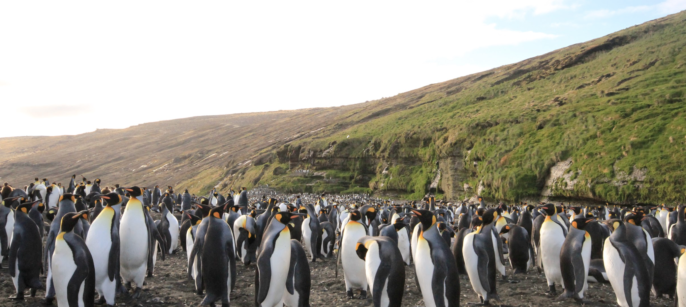

# King penguin genome assembly and annotation — analysis code

Scripts, configuration files and small result tables accompanying:

> Paris JR, Nitta Fernandes FA, Santos CA, Pointon D-LB, Wood JMD, Ferrer Obiol J, Salces-Ortiz J,
> Fernández R, Cristofari R, Le Bohec C, Trucchi E (2026).
> **A chromosome-level genome of the king penguin (*Aptenodytes patagonicus*): a resource for linking
> genotype to fitness in a long-lived vertebrate.** *Journal of Heredity*, in press.

[](https://doi.org/10.5281/zenodo.22968008)

Archived on Zenodo: this release (v1.0.0) [10.5281/zenodo.22968009](https://doi.org/10.5281/zenodo.22968009); all versions [10.5281/zenodo.22968008](https://doi.org/10.5281/zenodo.22968008).

<p align="center"></p>

'Pen/Se-guin' (bAptPat1) is a haplotype-resolved, chromosome-level assembly of an adult female king penguin
from Possession Island (Crozet), built from PacBio Revio HiFi reads (58.5 Gb) and Arima Hi-C data (126 Gb),
curated with the Sanger Tree of Life tools, and annotated with BRAKER3 using multi-tissue RNA-seq.

## Data and resources

| Resource | Accession / link |
|---|---|
| Primary haplotype bAptPat1.pri (chromosome level) | NCBI [GCA_965638725.1](https://www.ncbi.nlm.nih.gov/datasets/genome/GCA_965638725.1/); RefSeq [GCF_965638725.1](https://www.ncbi.nlm.nih.gov/datasets/genome/GCF_965638725.1/) |
| Alternate haplotype bAptPat1.alt | NCBI [GCA_965638715.1](https://www.ncbi.nlm.nih.gov/datasets/genome/GCA_965638715.1/) |
| HiFi and Hi-C reads, assemblies | ENA BioProject [PRJEB86486](https://www.ebi.ac.uk/ena/browser/view/PRJEB86486), samples SAMEA117789397 (pri) / SAMEA117789398 (alt), runs ERR14676056, ERR14673522 |
| Mitogenome (20,520 bp, annotated) | GenBank [PZ518787.1](https://www.ncbi.nlm.nih.gov/nuccore/PZ518787.1) |
| Multi-tissue RNA-seq and QuantSeq (Paris et al. 2025) | ENA [PRJEB64484](https://www.ebi.ac.uk/ena/browser/view/PRJEB64484) |
| DNA methylation, 64 birds (Cristofari et al. 2026) | [PRJNA1187342](https://www.ncbi.nlm.nih.gov/bioproject/PRJNA1187342) |
| Illumina WGS used for the short-read mitogenome | BioSample SAMN40942370 |
| Annotation files (GFF3/GTF, proteins, repeats, ncRNA, lncRNA) | [`annotation/`](annotation/) in this repository (archived with it on Zenodo, see above); first released in `josieparis/King-penguin-genome-annotation`, Zenodo [10.5281/zenodo.15021483](https://doi.org/10.5281/zenodo.15021483) |
| Previous draft assembly compared in the paper | BGI_Apat.V1, [GCA_010087175.1](https://www.ncbi.nlm.nih.gov/datasets/genome/GCA_010087175.1/) (Pan et al. 2019) |

## Provenance — please read

The scripts were gathered after the analyses from the working directories on the HPC cluster and on the
author's computer. Absolute paths have been replaced by `<path>`; file names, conda environment names and
scheduler headers are kept so the commands stay readable. Where a step was run more than once, only the final
version is kept. The first comment line of every script says which kind it is:

| Tag | Meaning |
|---|---|
| **original** | the script that was run, with paths redacted and, in a few cases, earlier variants or commented-out lines removed (the header says so). R scripts keep their `setwd()` lines. |
| **from log** | the command was run interactively and is copied from a log file (Nextflow `.nextflow.log`, tool logs, output-file headers). Parameters are exact. |
| **from notes** | the command was run interactively and is copied from the lab notebook / README kept next to the outputs. |
| **RECONSTRUCTED** | no script, log or note survives; the file is rewritten from the parameters in the paper's Methods and Table 1 plus the surviving input/output files. Each such file says so in its header. |

Steps carried out at the Wellcome Sanger Institute by Camilla Santos, Damon-Lee Pointon and Jonathan Wood
(TreeVal/curationpretext maps, ASCC/FCS-GX contamination screen, MicroFinder, PretextView curation and the
rapid-curation FASTA generation) used the Sanger Tree of Life pipelines; the commands run here to feed and
finish that process are in `04_hic_scaffolding/` and `05_manual_curation/`.

## Pipeline

```
01_sequence_data/        fastp cleaning of the Hi-C libraries, FASTQ->CRAM, HiFi read statistics, ENA manifests
02_genome_profiling/     21-mer histogram -> GenomeScope2                                                (Figure S1)
03_hifiasm_assembly/     hifiasm, Hi-C integrated mode (hap1 / hap2 contigs)
04_hic_scaffolding/      Chromap -> YaHS -> Juicer (.hic) ; sanger-tol/curationpretext contact maps        (Figure S2)
05_manual_curation/      N-gap checks, BLAST contamination check, HiFi/Hi-C coverage, self-alignment, nucmer synteny
                         vs five birds, MicroFinder outputs, splitting / re-ordering the curated FASTAs
06_assembly_qc/          QUAST, Merqury (QV, completeness), BUSCO (genome), tidk telomeres (Figure S3), NCBI stats (Table 2)
07_mitogenome/           NUMT screen, MitoHiFi, NOVOPlasty, duplication support (Supplementary figure), GenBank feature table
08_repeat_annotation/    Earl Grey with the curated avian TE library
09_gene_annotation/      RNA-seq trimming, HISAT2, BRAKER3, UTRs/AGAT, BUSCO, OMArk, InterProScan, eggNOG (Table 2)
10_ncRNA_annotation/     Infernal/Rfam, RNAmmer, tRNAscan-SE (+ S. humboldti), novel lncRNA pipeline
11_expression_quantseq/  bbduk, STAR, HTSeq, DESeq2 PCA and tissue-enhanced genes, expression bins (Figure 2)
12_figures/              Circos configuration and track preparation (Figure 1, Figure 2C)
annotation/              released annotation files (gene models, proteins, repeats, ncRNA, lncRNA)
docs/                    software versions and parameters (Table 1)
```

Each directory has its own README with the order of the steps, the key parameters and the outputs. Small text
results (QUAST/BUSCO/Merqury summaries, tidk tables, AGAT statistics, NOVOPlasty log, mitogenome depth tables)
are in `results/` sub-folders. Large intermediate files are archived by the authors and are available on request.

## How to cite

Please cite the repository itself (all versions):

> Paris JR, Nitta Fernandes FA, Santos CA, Pointon D-LB, Wood JMD, Ferrer Obiol J, Salces-Ortiz J, Fernández R,
> Cristofari R, Le Bohec C, Trucchi E (2026). **King-penguin-genome-assembly.** Zenodo.
> https://doi.org/10.5281/zenodo.22968008

GitHub's *Cite this repository* button gives the same reference (from `CITATION.cff`).

## Software

Versions and parameters as reported in Table 1 of the paper: [docs/software_versions.md](docs/software_versions.md).

## Contact

Josephine R. Paris — parisjosephine@gmail.com · [josieparis.github.io](https://josieparis.github.io)
